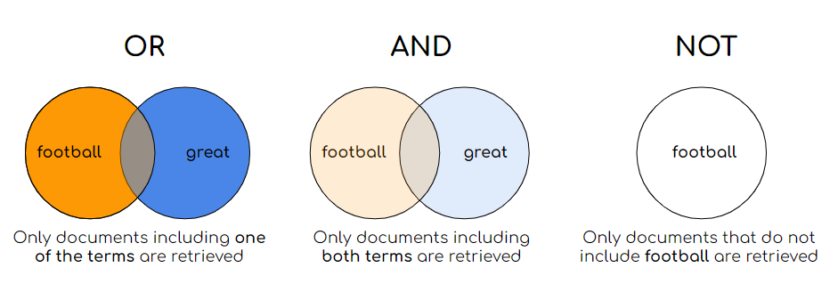

 

Please find, for now, the report <a href = "https://github.com/geosarr/search-engine/blob/main/ML_for_NLP_ENSAE_Report.pdf" >here </a>.

# Searching as Ranking
The main goal of a search engine is to retrieve all relevant information from a collection of information (say, a set of documents) for a given query. Several methods can be applied to do so. We focus on textual information retrieval.

## Set theoretic models
They use the terms in the query and match them with the terms in the collection documents. The arguably easiest model is the Boolean model which matches query terms and documents using the logical relations OR, AND, NOT, mixed or not between query terms. For example the query = "football is great" can be interpreted as find all the documents that contain "football" AND "great", or "football" OR "great", "football" AND NOT "great", etc. One of the main pitfalls of such models is the lack of order in the retrieved documents: there is no ranking. The following models suggest a ranking scheme of the documents.

## Binary Independence Model (BIM) and its extensions
These models give estimations of the probability that a document is relevant for a given query. Doing some maths under some assomptions, this probability is estimated with closed formulas. The extensions of BIM (Two-Poisson, BM11 and BM25) are more performant, because they take into account the length of the documents and their terms frequencies, giving more weight to relatively short documents with high frequency query terms (for BM11 and BM25). 

